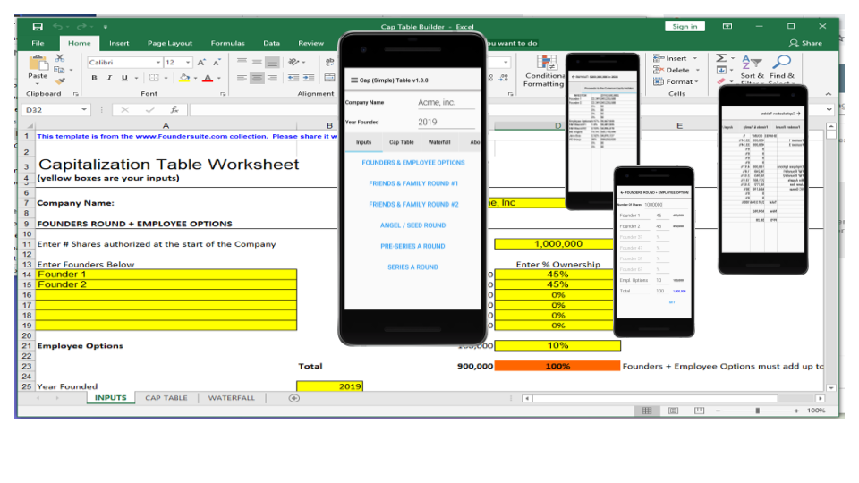

# Cap (Simple) Table
> A CodenameOne project for a mobile App to learn about Capitalization Tables on the go.

This App is based on a spreadsheet from the www.foundersuite.com site. It's meant to 
provide an easy way to learn about capitalization tables while on the go. 

## Release History

* 1.0.0
    * First release which contains the full functionality found in the spreadsheet.

## Meta

Nathan Stevens – nathan.stevens@instras.com

Distributed under the GPL license.
